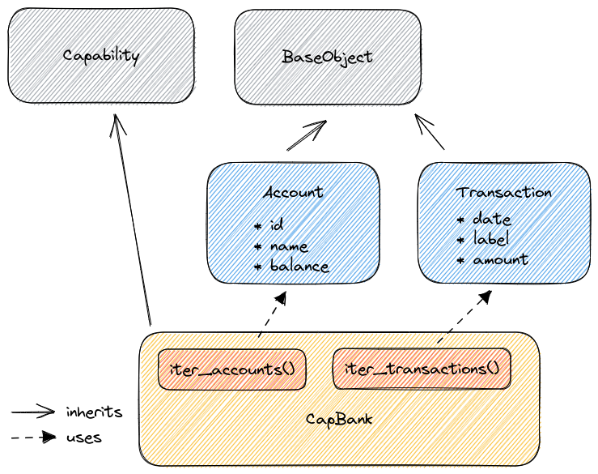

Capabilities
============

Abstract
--------

A capability is a class which inherits from :mod:`~woob.capabilities.base.Capability` and exposes several standard methods
implemented by modules who use this capability.

It has to be the more standard as possible, to exclude specific things related to a particular website, as the application which will call methods of the
capability haven't to know from which module results come.

Documentation
-------------

.. toctree::
   :maxdepth: 2

   create
   Available capabilities </api/capabilities/index>
