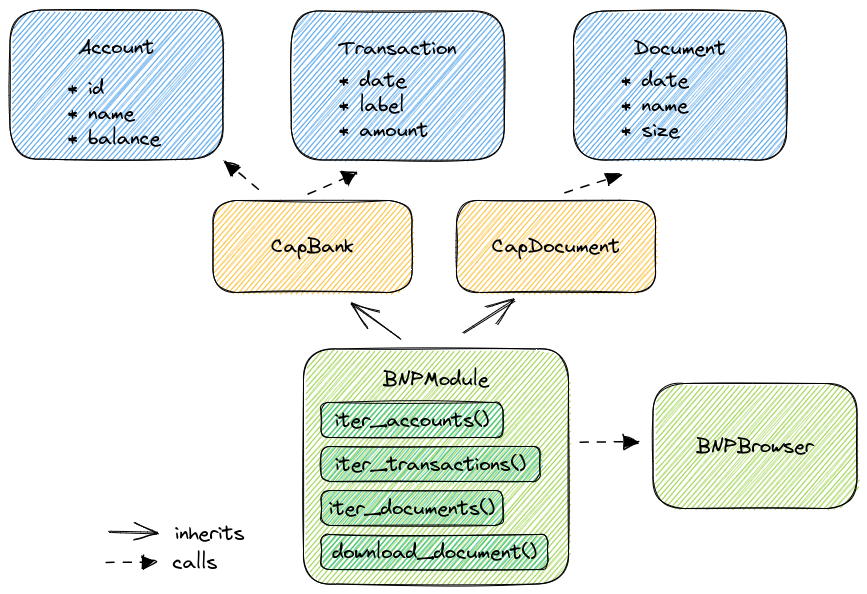

Module class
*************

Edit ``module.py``. It contains the main class of the module derived from :class:`~woob.tools.backend.Module` class::

    from woob.tools.backend import Module
    from woob.capabilities.bank import CapBank

    class ExampleModule(Module, CapBank):
        NAME = 'example'                         # The name of module
        DESCRIPTION = u'Example bank website'    # Description of your module
        MAINTAINER = u'John Smith'               # Name of maintainer of this module
        EMAIL = 'john.smith@example.com'         # Email address of the maintainer
        LICENSE = 'LGPLv3+'                      # License of your module
        # Version of woob
        VERSION = '3.3.1'

In the code above, you can see that your ``ExampleModule`` inherits :class:`~woob.capabilities.bank.base.CapBank`, as
we have selected it for the supported website.

Configuration
-------------

When a module is instanced as a backend, you probably want to ask parameters to user. It is managed by the ``CONFIG`` class
attribute. It supports key/values with default values and some other parameters. The :class:`~woob.tools.value.Value`
class is used to define a value.

Available parameters of :class:`~woob.tools.value.Value` are:

* **label** - human readable description of a value
* **required** - if ``True``, the backend can't be loaded if the key isn't found in its configuration
* **default** - an optional default value, used when the key is not in config. If there is no default value and the key
  is not found in configuration, the **required** parameter is implicitly set
* **masked** - if ``True``, the value is masked. It is useful for applications to know if this key is a password
* **regexp** - if specified, the specified value is checked against this regexp upon loading, and an error is raised if
  it doesn't match
* **choices** - if this parameter is set, the value must be in the list

.. note::

    There is a special class, :class:`~woob.tools.value.ValueBackendPassword`, which is used to manage
    private parameters of the config (like passwords or sensitive information).

.. note::

    Other classes are available to store specific types of configuration options. See :mod:`woob.tools.value
    <woob.tools.value>` for a full list of them.

For example::

    from woob.tools.backend import Module, BackendConfig
    from woob.capabilities.bank import CapBank
    from woob.tools.value import Value, ValueBool, ValueInt, ValueBackendPassword

    # ...
    class ExampleModule(Module, CapBank):
        # ...
        CONFIG = BackendConfig(Value('username',                label='Username', regexp=r'.+'),
                               ValueBackendPassword('password', label='Password'),
                               ValueBool('get_news',            label='Get newspapers', default=True),
                               Value('choice',                  label='Choices', choices={'value1': 'Label 1',
                                                                                          'value2': 'Label 2'}, default='1'),
                               Value('regexp',                  label='Birthday', regexp=r'^\d+/\d+/\d+$'),
                               ValueInt('integer',              label='A number', required=True))

Implement capabilities
----------------------

You need to implement each method of all of the capabilities your module implements. For example, in our case::

    from woob.tools.backend import Module
    from woob.capabilities.bank import CapBank

    # ...
    class ExampleModule(Module, CapBank):
        # ...

        def iter_accounts(self):
            raise NotImplementedError()

        def get_account(self, id):
            raise NotImplementedError()

        def iter_history(self, account):
            raise NotImplementedError()

        def iter_coming(self, account):
            raise NotImplementedError()

If you ran the ``boilerplate`` script command ``cap``, every methods are already in ``module.py`` and documented.

Read :class:`documentation of the capability <woob.capabilities.bank.base.CapBank>` to know what are types of arguments,
what are expected returned objects, and what exceptions it may raise.

When you are done writing your module, you should remove all the not implemented methods from your module, as the base
capability code will anyway ``raise NotImplementedError()``.

