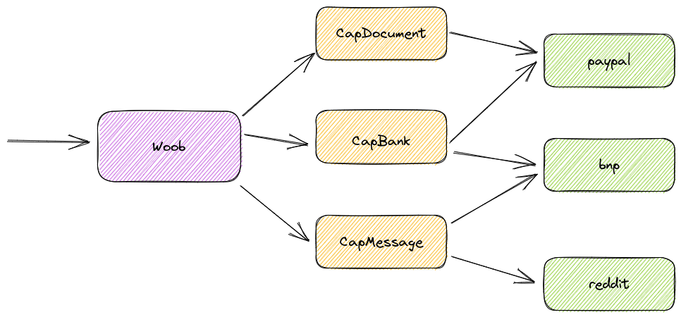

============
woob library
============

|version| |last-commit| |python| |license|

.. |version| image:: https://img.shields.io/pypi/v/woob
    :target: https://pypi.org/project/woob/
    :alt: Package Version
.. |last-commit| image:: https://img.shields.io/gitlab/last-commit/woob/woob
    :target: https://gitlab.com/woob/woob/
    :alt: Last commit
.. |python| image:: https://img.shields.io/pypi/pyversions/woob
    :target: https://pypi.org/project/woob/
    :alt: Python Version
.. |license| image:: https://img.shields.io/pypi/l/woob
    :target: https://gitlab.com/woob/woob/-/blob/master/COPYING.LESSER
    :alt: License

Woob is a project which provides a Python standardized API and data models to
access websites.

Abstract
--------

There are three main concepts:

* :doc:`Capabilities <guides/capabilities/index>`: This is a standardized interface
  to access a specific kind of website. It provides an unified API and standard
  datamodels;
* :doc:`Modules <guides/modules/index>`: A module is dedicated to a specific
  website. It can implements several capabilities (for example `paypal` may
  implement :class:`~woob.capabilities.bank.base.CapBank` to get bank
  informations, :class:`~woob.capabilities.bank.transfer.CapBankTransfer` to
  initiate a transfer, :class:`~woob.capabilities.profile.CapProfile` to get
  information about the customer, and
  :class:`~woob.capabilities.bill.CapDocument` to get documents);
* :doc:`Backends </guides/user/quickstart>`: You can load a module several times,
  with different configurations. For example, if you have two PayPal accounts,
  you can create two backends of the same module with different credentials.

The main :class:`~woob.core.woob.Woob` class let configure new backends and do
aggregated calls to every backends loaded with a specific capability.

Documentation
-------------

* :doc:`guides/install/index`
* :doc:`guides/user/index`
* :doc:`guides/modules/index`
* :doc:`guides/capabilities/index`
* :doc:`guides/contribute/index`

Examples
--------

Video search
============

.. code-block::

    >>> from woob.core import Woob
    >>> from woob.capabilities.bank import CapVideo
    >>> w = Woob()
    >>> w.load_backend(CapVideo)
    {'vimeo': <Backend 'vimeo'>,
     'youtube': <Backend 'youtube'>}
    >>> for video in w.search_videos('pink floyd'):
    ...     print(f'{video.id}@{video.backend}: {video.title}')
    ...
    Hh1Xyvu68P0@youtube: P̲ink F̲lo̲yd - T̲h̲e̲ D̲ark S̲ide̲ Of T̲h̲e̲ Mo̲o̲n (Full Album) 1973
    IXdNnw99-Ic@youtube: Pink Floyd - Wish You Were Here
    cuKVhVb8VRw@youtube: The D̲ark S̲ide of the Mo̲o̲n (Full Album) 1973
    _FrOQC-zEog@youtube: Pink Floyd - Comfortably numb
    191099965@vimeo: Pink Floyd - Echoes
    184017902@vimeo: Pink Floyd - Dogs
    94573195@vimeo: Pink Panther Floyd
    31536402@vimeo: PINK FLOYD - PULSE

See :mod:`woob.capabilities.video`.

Banking aggregation
===================

.. code-block::

    >>> from woob.core import Woob
    >>> w = Woob()
    >>> w.load_backend('societegenerale', 'soge',
    ...                config={'login': '1234', 'password': '5678'})
    <Backend 'soge'>
    >>> w.load_backend('creditmutuel', 'cm',
    ...                config={'login': '1234', 'password': '5678'})
    <Backend 'cm'>
    >>> for account in w.iter_accounts():
    ...     print(f'{account.id}@{account.backend} {account.label:>40} {account.balance} {account.currency_text}')
    1234567789@soge                           Compte chèque 1528.39 €
    DL00012345@cm          COMPTE CHEQUES 1 ROGER PHILIBERT 100.00 €
    DD99874634@cm  PRET PRIMO ACCEDANT - ACHAT D'ANCIEN SEUL -9555.52 €
    >>> account = w['cm'].get_account('DD99874634')
    >>> account
    <Loan id='DD99874634' label="PRET PRIMO ACCEDANT - ACHAT D'ANCIEN SEUL">
    >>> account.subscription_date
    date(2022, 6, 2)
    >>> account.total_amount
    Decimal('10000.0')
    >>> account.next_payment_amount
    Decimal('59.43')
    >>> account.next_payment_date
    date(2023, 3, 5)

See :mod:`woob.capabilities.bank.base`.

.. toctree::
   :includehidden:
   :hidden:
   :caption: Documentation
   :glob:

   guides/install/index
   guides/user/index
   guides/modules/index
   guides/capabilities/index
   guides/contribute/index

.. sorted-toctree::
   :caption: API Reference
   :hidden:
   :glob:
   :includehidden:

   api/*
   api/*/index
